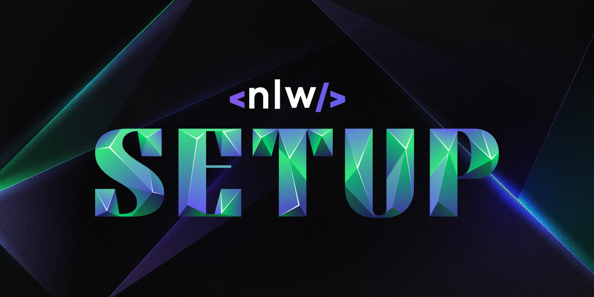
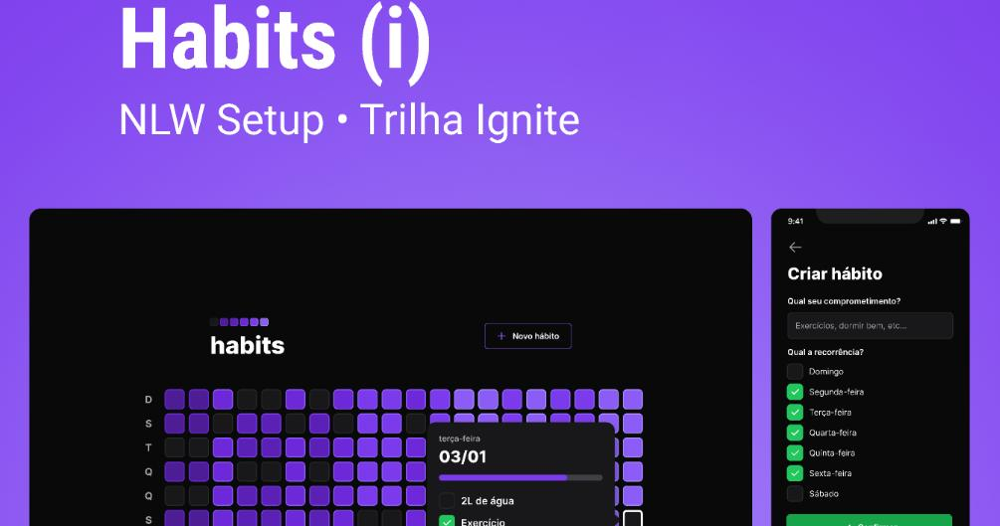

<h1 align="center">
    
</h1>

  <a href="#rocket-tecnologias">Tecnologias</a>&nbsp;&nbsp;&nbsp;|&nbsp;&nbsp;&nbsp;
  <a href="#-projeto">Projeto</a>&nbsp;&nbsp;&nbsp;|&nbsp;&nbsp;&nbsp;
  <a href="#-layout">Layout</a>&nbsp;&nbsp;&nbsp;

  

## 🚀 Technology

This project was developed with the following technologies:

- [Node.js](https://nodejs.org/en/)
- [React](https://reactjs.org)
- [React Native](https://facebook.github.io/react-native/)
- [Expo](https://expo.io/)
- [Fastify](https://www.fastify.io/)
- [Prisma](https://www.prisma.io/)
- [Zod](https://zod.dev/)
- [Day.js](https://day.js.org/)
- [Tailwind CSS](https://tailwindcss.com/)
- [Radix](https://www.radix-ui.com/)

## 💻 Project

An application to control daily habits.

---

## 🔖 Layout

In the link below you can find the layout of the web and mobile project. Remembering that you need to have an account at [Figma](http://figma.com/) to access it.

- [Layout](https://www.figma.com/community/file/1195326661124171197)

---

<h4>
    Done with 💛 by <a href="https://www.linkedin.com/in/diego-ribeiro-10a14477/" target="_blank">Diego Ribeiro</a>
</h4>
